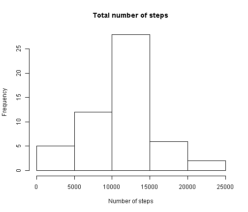
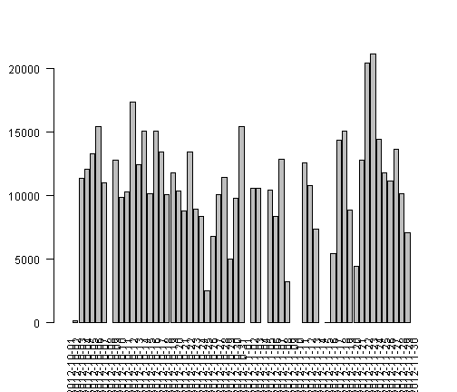
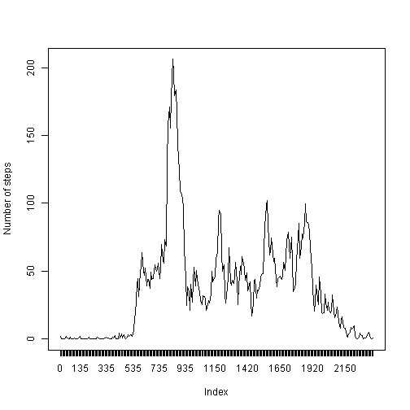
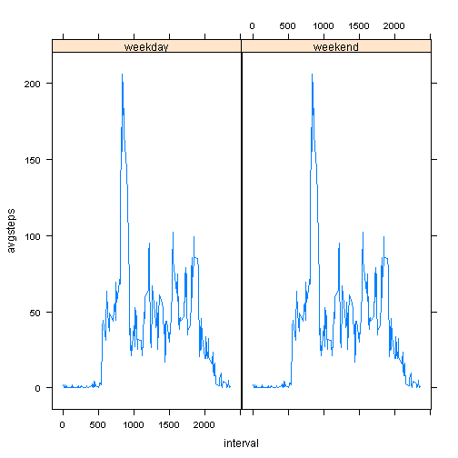

# Reproducible Research: Peer Assessment 1

16.5.2014

## Loading and preprocessing the data

Load the data from file and do the transformations


```r

Sys.setlocale("LC_TIME", "English")
```

```
## [1] "English_United States.1252"
```

```r

activity <- read.csv("C:/Users/piisptau/Downloads/activity.csv", sep = ",", 
    header = T, stringsAsFactors = F)
```


Transform date and time fields


```r

activity$acttime <- strptime(paste(activity$date, formatC(activity$interval, 
    width = 4, format = "d", flag = "0")), format = "%Y-%m-%d %H%M")

activity$date <- as.Date(activity$date, format = "%Y-%m-%d")
```


##  What is mean total number of steps taken per day?

Histogram of the total number of steps taken each day


```r

hist(tapply(activity$steps, activity$date, sum), main = "Total number of steps", 
    xlab = "Number of steps", ylab = "Frequency")
```

 

```r

par(las = 2)
barplot(tapply(activity$steps, activity$date, sum))
```

 


Mean and median total number of steps taken per day


```r

mean(tapply(activity$steps, activity$date, sum, na.rm = T))
```

```
## [1] 9354
```

```r

median(tapply(activity$steps, activity$date, sum, na.rm = T))
```

```
## [1] 10395
```

```r

```


## What is the average daily activity pattern?

Average number of steps taken


```r

r1 = tapply(activity$steps, activity$interval, mean, na.rm = T)

par(las = 0)
plot(r1, type = "l", xaxt = "n", ylab = "Number of steps")
axis(1, at = 1:288, labels = names(r1))
```

 


Interval with maximum number of steps occurs at 0835


```r
r1[which.max(r1)]
```

```
##   835 
## 206.2
```


## Imputing missing values

Missing steps values are replaced with the average number of steps for that intevrval. New value is placed in the column newsteps.

Summary of activity data frame shows the number of missing values in steps column. There are 2304 rows with missing (NA) steps value.


```r

summary(activity)
```

```
##      steps            date               interval   
##  Min.   :  0.0   Min.   :2012-10-01   Min.   :   0  
##  1st Qu.:  0.0   1st Qu.:2012-10-16   1st Qu.: 589  
##  Median :  0.0   Median :2012-10-31   Median :1178  
##  Mean   : 37.4   Mean   :2012-10-31   Mean   :1178  
##  3rd Qu.: 12.0   3rd Qu.:2012-11-15   3rd Qu.:1766  
##  Max.   :806.0   Max.   :2012-11-30   Max.   :2355  
##  NA's   :2304                                       
##     acttime                   
##  Min.   :2012-10-01 00:00:00  
##  1st Qu.:2012-10-16 05:58:45  
##  Median :2012-10-31 11:57:30  
##  Mean   :2012-10-31 11:30:47  
##  3rd Qu.:2012-11-15 17:56:15  
##  Max.   :2012-11-30 23:55:00  
## 
```


Replace missing values with average number of steps for that interval and create a new imputed data frame m2.


```r

d1 = aggregate(steps ~ interval, data = activity, mean)

colnames(d1) = c("interval", "avgsteps")

m2 = merge(activity, d1, by.x = "interval", by.y = "interval")

m2$newsteps = ifelse(is.na(m2$steps), m2$avgsteps, m2$steps)
```


Produce a new histogram from the imputed data frame m2


```r

hist(tapply(m2$newsteps, m2$date, sum), main = "Total number of steps", xlab = "Number of steps", 
    ylab = "Frequency")
```

 


Calculate new steps mean and median from the imputed data frame


```r

mean(tapply(m2$newsteps, m2$date, sum))
```

```
## [1] 10766
```

```r

median(tapply(m2$newsteps, m2$date, sum))
```

```
## [1] 10766
```


Before imputing the steps mean was 9354 and median 10395. Now mean and median are equal.


## Creating weekday factor variable

Weekday factor variable has value "weekend" if weekday is Saturday or Sunday, otherwise the variable value is "weekday".


```r

m2$wday = weekdays(m2$date)

m2$weekend = m2$wday == "Saturday" | m2$wday == "Sunday"

m2$wefactor = factor(m2$weekend, levels = c("FALSE", "TRUE"), labels = c("weekday", 
    "weekend"))

```


## Are there differences in activity patterns between weekdays and weekends?

Average number of steps taken during 5-minute intervals during weekdays and weekend


```r

library(lattice)
po <- xyplot(avgsteps ~ interval | wefactor, data = m2, type = "l")

print(po)
```

 

